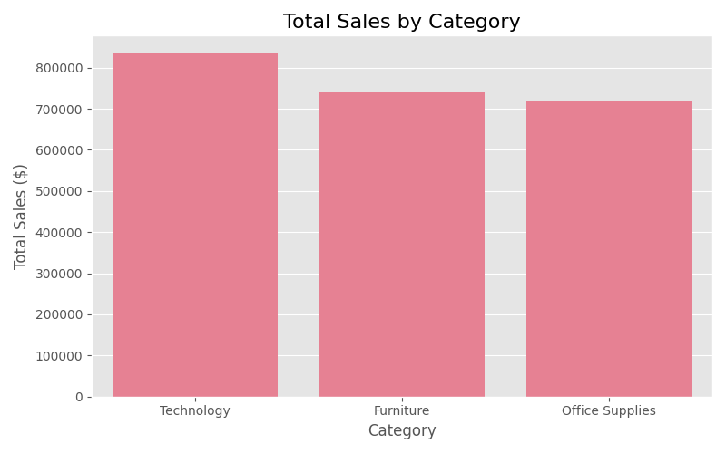
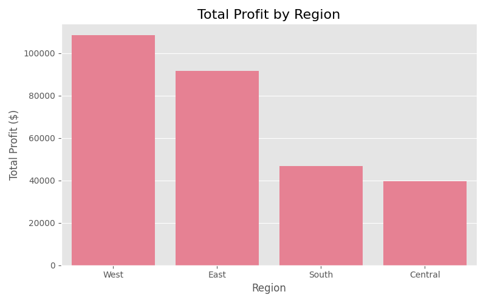
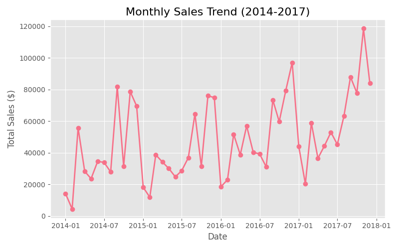
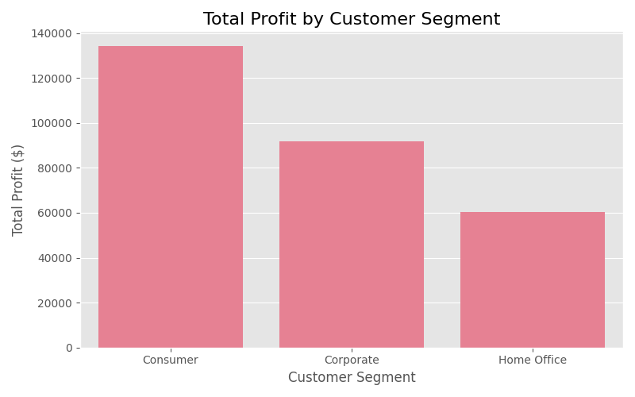
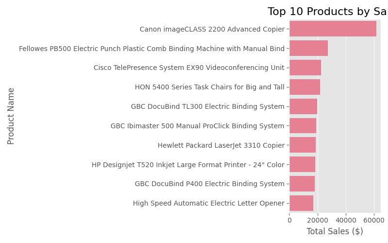

# 🛒 Superstore Sales Performance Analysis

## 📌 Overview
Analyzed 9,994 US retail sales records (2014–2017) using Python to uncover 
key business trends, regional performance, and product insights.

## 🛠️ Tools & Technologies
- Python (Pandas, Matplotlib, Seaborn)
- Jupyter Notebook | VS Code
- Dataset: Superstore Sales (Kaggle)

## 📊 Key Insights
- **Technology** is the top revenue category ($836K)
- **West region** is most profitable ($108K)
- Sales spike every **November–December** (holiday season)
- **Consumer segment** drives highest profit ($134K)
- **Canon imageCLASS 2200** is #1 best selling product ($61K)

## 📈 Visualizations

